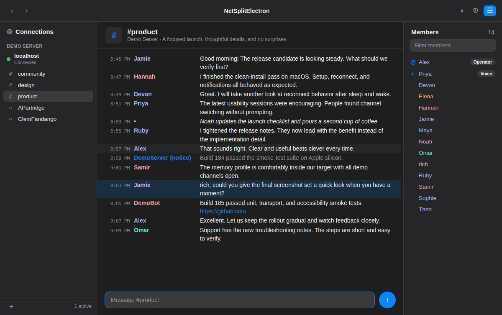

# Netsplit (Electron)

A cross-platform **Electron port of [Netsplit](https://github.com/richstokes/Netsplit)**,
the modern macOS IRC client — rebuilt so it runs on **Linux and Windows** while keeping
the look and feel of the original as close as possible.

The original is a native Swift/SwiftUI app and only runs on macOS. This port
reproduces its three-pane workspace (connections · transcript · members), its
16 hand-tuned color themes, and a working IRC core, in a single Electron app.



## Status

This is a faithful first port of the **look and the core client**. It connects to
real IRC networks over TLS, joins channels, tracks members, and speaks the common
command set. A few macOS-platform-specific features from the original are noted as
follow-ups below.

### Implemented

- **Three-pane UI** matching the original: connections sidebar with per-server
  groups and status dots, message transcript with aligned timestamp / nickname /
  text columns, and a members list with operator/voice prefixes and role badges.
- **All 16 appearances** ported 1:1 from the Swift theme files
  (System, Light, Dark, Catppuccin Latte/Mocha, Everforest Light, GitHub
  Light/Dark, Gruvbox Dark, Nord, Rosé Pine / Dawn, Solarized Sepia, Cyberpunk,
  C64, Greyscale, Lobster), including the deterministic FNV-1a nickname coloring.
- **Real IRC** over TLS or plain TCP (Node `tls`/`net` in the main process),
  with RFC 1459 + IRCv3 message-tag parsing, ISUPPORT/PREFIX handling, CTCP
  ACTION and auto-replies (VERSION/PING/TIME), and PING/PONG keepalive.
- **Channels & DMs**: join/part, topics, NAMES, JOIN/PART/QUIT/KICK/NICK/MODE
  tracking, private messages, server notices, unread badges, and mention
  highlighting.
- **Commands**: `/server /join /part /msg /query /me /notice /nick /topic /whois
  /who /mode /kick /invite /away /quit /connect /clear /raw` and pass-through of
  any other command straight to the server. You can connect entirely by typing —
  `/server irc.libera.chat` opens a network, then `/join #channel` from the
  server console — no dialog required.
- **Command palette** (⌘/Ctrl+K) to jump between servers, channels, and DMs.
- **Composer niceties**: input history (↑/↓), tab nickname completion, link
  detection that opens in the system browser.
- **Demo Server** — an offline sample network (File → Load Demo Server) so you
  can preview the client without connecting.

### Deferred (follow-ups)

These exist in the native app and rely on macOS-specific facilities; they are not
in this first port:

- **SSH tunnel connections** (password / Ed25519 key, host-key pinning).
- **macOS Keychain** storage for passwords and on-connect commands. This port
  stores server profiles in the renderer's `localStorage`; **passwords entered in
  the connect dialog are saved there in plain text**, so treat that as a
  convenience, not secure storage, until a proper secret store is wired in.
- Rich link-preview cards, the full 40+ moderation command set, and per-server
  on-connect automation.

## Running

Requires Node.js 18+.

```bash
npm install
npm start
```

On Linux you may need `--no-sandbox` in some containerized environments; a normal
desktop install does not.

## Building installers

```bash
npm run dist:linux   # AppImage + .deb
npm run dist:win     # NSIS installer
```

Output lands in `dist/`. See [electron-builder](https://www.electron.build/) for
signing and additional target formats.

## Project layout

```
src/
  main/
    main.js            Electron main process: window, menu, IPC, lifecycle
    ircConnection.js   One TCP/TLS socket per server; line framing only
  preload/
    preload.js         contextBridge surface (no Node access in renderer)
  renderer/
    index.html         Three-pane layout + modals
    styles.css         Theme-variable-driven styling
    themes.js          All 16 palettes + nickname hashing
    ircProtocol.js     IRC message / CTCP / ISUPPORT parsing
    app.js             State, protocol handling, rendering, commands
```

## Credits

Original macOS app **Netsplit** by [Rich Stokes](https://github.com/richstokes/Netsplit).
This is an independent cross-platform port and is not affiliated with or endorsed
by the original author.

## License

MIT
